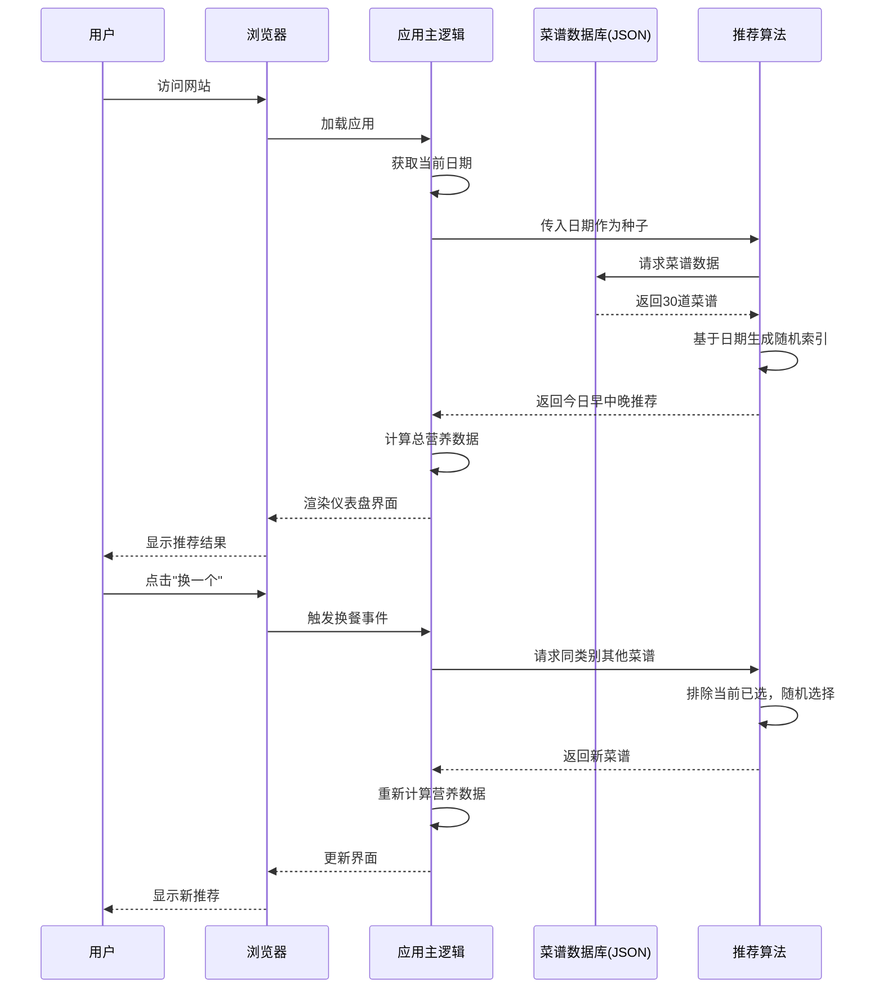
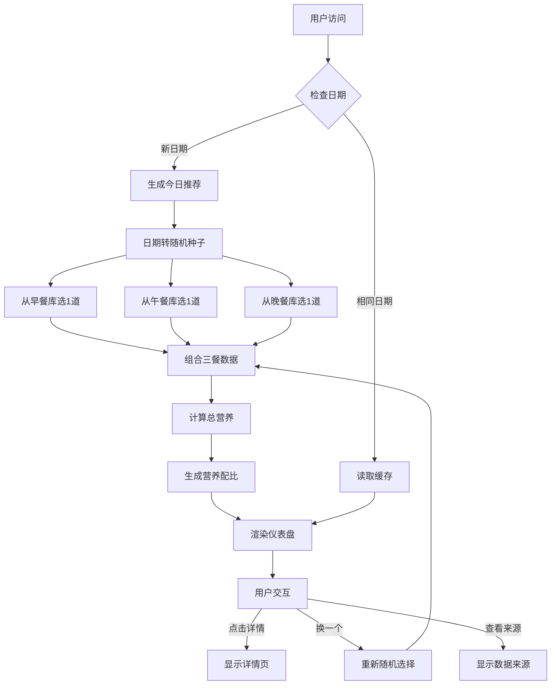

# 产品需求文档 (PRD)
## 营养餐推荐网站 - MVP版本

**文档版本**: 1.0
**创建日期**: 2026-02-14
**产品负责人**: [待填写]
**设计方案**: 方案C - 仪表盘数据风格

---

## 📋 目录
1. [产品概述](#产品概述)
2. [产品路线图](#产品路线图)
3. [MVP原型设计](#mvp原型设计)
4. [架构设计](#架构设计)
5. [技术规范](#技术规范)
6. [数据契约](#数据契约)
7. [风险与应对](#风险与应对)

---

## 产品概述

### 核心目标 (Mission)
**"让每一餐都营养均衡，告别选择困难和重复疲劳"**

为不知道下一顿吃什么的人，提供经过营养认证的早中晚餐搭配方案，确保每天不重样、吃得饱、有营养。

### 用户画像 (Persona)

**主要用户群体**：
- 独居上班族（工作日午餐困难）
- 学生党（预算有限，需要营养）
- 家庭主妇/主夫（每天变花样的压力）
- 健身/减脂人群（注重营养配比）

**核心痛点**：
1. **营养焦虑**：不知道自己吃得是否健康，缺乏营养知识
2. **重复疲劳**：总是吃那几样，缺乏灵感
3. **选择困难**：面对无数菜谱不知道选哪个

**使用场景**：
- 早上起床：打开网站看今天早餐吃什么
- 午餐前：查看推荐，决定去哪买菜/点外卖
- 晚上下班：按照推荐的菜谱做晚餐

---

## 产品路线图

### V1: 最小可行产品 (MVP)

**核心价值**：提供10天不重样的营养餐推荐

**必须功能清单**：

1. **每日推荐系统**
   - 基于日期自动生成当天的早中晚三餐推荐
   - 同一天访问看到相同推荐，第二天自动更新
   - "换一个"按钮（从剩余菜谱中随机选择）

2. **菜品详情页**
   - 菜品名称 + 高清图片
   - 简短描述（口味、特点）
   - 详细烹饪步骤（分步骤编号）
   - 预计烹饪时间
   - 难度等级（简单/中等/困难）

3. **营养数据展示**
   - 每道菜的卡路里（kcal）
   - 三大营养素：蛋白质、碳水化合物、脂肪（克）
   - 全天总卡路里汇总
   - 营养配比可视化（进度条）

4. **移动端适配**
   - 响应式设计，手机/平板/桌面完美显示
   - 触摸友好的交互
   - 快速加载（静态网站优势）

5. **数据来源透明化**
   - 每道菜标注引用平台/网站
   - 首页显示数据来源说明
   - 免责声明页面

**内容规模**：
- **30道家常菜**（早餐10道、午餐10道、晚餐10道）
- 支持10天不重样的推荐
- 所有食材在普通菜市场/超市可购买

### V2 及以后版本 (Future Releases)

**V2.0 - 个性化与扩展**（3-6个月后）
- 菜谱库扩充到100+道菜
- 用户账户系统（注册/登录）
- 个性化偏好（忌口、地域口味、卡路里目标）
- 收藏与历史记录功能

**V2.5 - 运动与健康**（6-9个月后）
- 运动推荐系统
- 健康报告（周/月营养分析）

**V3.0 - 社交与商业化**（9-12个月后）
- 社区功能（评价、晒图）
- 食材购买（对接生鲜电商）
- 高级会员功能

---

## MVP原型设计

### 选定方案：方案C - 仪表盘数据风格

#### 首页（仪表盘）
```
┌─────────────────────────────────────────┐
│  🍽️ 今日营养仪表盘  2026-02-14         │
│  ─────────────────────────────────────  │
│                                         │
│  ┌─────────────────────────────────┐   │
│  │  📊 今日营养摄入                │   │
│  │                                 │   │
│  │      ┌─────────┐                │   │
│  │      │  1350   │                │   │
│  │      │  kcal   │                │   │
│  │      └─────────┘                │   │
│  │   目标：1400-2000 kcal          │   │
│  │                                 │   │
│  │   蛋白质 75g  ████████░░ 75%    │   │
│  │   碳水 145g   ██████░░░░ 60%    │   │
│  │   脂肪 48g    █████░░░░░ 50%    │   │
│  └─────────────────────────────────┘   │
│                                         │
│  ┌───────┬───────┬───────┐             │
│  │ 早餐  │ 午餐  │ 晚餐  │             │
│  │ 280   │ 650   │ 420   │             │
│  │ kcal  │ kcal  │ kcal  │             │
│  ├───────┼───────┼───────┤             │
│  │┌─────┐│┌─────┐│┌─────┐│             │
│  ││[图] │││[图] │││[图] ││             │
│  │└─────┘│└─────┘│└─────┘│             │
│  │番茄   │宫保   │清蒸   │             │
│  │炒蛋   │鸡丁   │鲈鱼   │             │
│  │       │       │       │             │
│  │⏱️15min│⏱️30min│⏱️25min│             │
│  │简单   │中等   │中等   │             │
│  │       │       │       │             │
│  │[详情] │[详情] │[详情] │             │
│  │[换]   │[换]   │[换]   │             │
│  └───────┴───────┴───────┘             │
│                                         │
│  ━━━━━━━━━━━━━━━━━━━━━━━━━━━━━━━━━━━  │
│  📚 数据来源                            │
│  本站菜谱综合对比以下平台：             │
│  • USDA FoodData Central (营养数据)    │
│  • Edamam 营养分析平台                  │
│  • 下厨房、豆果美食 (菜谱参考)          │
│  • 中国居民膳食指南                     │
│                                         │
│  ⚠️ 营养建议仅供参考，个体需求因人而异  │
│  [查看详细说明]                         │
└─────────────────────────────────────────┘
```

#### 设计理念
- **数据优先**：营养摄入一目了然，符合健康管理需求
- **三餐并列**：方便对比和快速浏览
- **仪表盘风格**：专业可信，适合关注营养数据的用户
- **来源透明**：数据来源集中展示，增强可信度

---

## 架构设计

### 核心流程图

#### 用户访问流程


#### 数据流架构


### 文件结构与组件交互

#### 项目文件结构
```
nutrition-meal-planner/
├── index.html              # 主页（仪表盘）
├── detail.html             # 详情页模板
├── about.html              # 关于/免责声明页
├── css/
│   ├── main.css           # 主样式
│   ├── dashboard.css      # 仪表盘样式
│   └── mobile.css         # 移动端适配
├── js/
│   ├── app.js             # 应用主逻辑
│   ├── recommend.js       # 推荐算法模块
│   ├── nutrition.js       # 营养计算模块
│   ├── ui.js              # UI渲染模块
│   └── utils.js           # 工具函数
├── data/
│   ├── breakfast.json     # 早餐菜谱库（10道）
│   ├── lunch.json         # 午餐菜谱库（10道）
│   ├── dinner.json        # 晚餐菜谱库（10道）
│   └── sources.json       # 数据来源说明
└── images/
    └── recipes/           # 菜谱图片
```

#### 核心模块职责

**app.js（应用主控制器）**
- 初始化应用
- 协调各模块
- 管理应用状态
- 调用关系：app.js → recommend.js → nutrition.js → ui.js

**recommend.js（推荐算法模块）**
- 基于日期生成伪随机推荐
- 处理"换一个"逻辑
- 避免重复推荐
- 被调用：app.js | 调用：data/*.json

**nutrition.js（营养计算模块）**
- 计算三餐总营养
- 生成营养配比百分比
- 提供营养评估
- 被调用：app.js, ui.js

**ui.js（UI渲染模块）**
- 渲染仪表盘界面
- 渲染详情页
- 处理用户交互事件
- 被调用：app.js | 调用：nutrition.js

---

## 技术规范

### 技术栈选型

| 层级 | 技术选型 | 理由 |
|------|---------|------|
| **前端框架** | 原生JavaScript (ES6+) | 静态网站，无需框架开销，加载速度快 |
| **样式** | CSS3 + Flexbox/Grid | 响应式布局，移动端适配 |
| **数据存储** | 静态JSON文件 | 无需数据库，部署简单，成本为零 |
| **构建工具** | 无（可选Vite） | 开发阶段可用Vite热更新，生产直接部署静态文件 |
| **部署平台** | GitHub Pages / Vercel / Netlify | 免费托管，自动HTTPS，CDN加速 |
| **图片优化** | WebP格式 + 懒加载 | 减少加载时间，提升移动端体验 |

### 关键算法：日期种子随机算法

```javascript
// 核心思路：将日期转换为数字种子，生成可复现的随机序列
function dateToSeed(dateString) {
  // "2026-02-14" → 20260214
  return parseInt(dateString.replace(/-/g, ''))
}

function seededRandom(seed, max) {
  // 使用线性同余生成器（LCG）
  const a = 1103515245
  const c = 12345
  const m = 2147483648
  seed = (a * seed + c) % m
  return Math.floor((seed / m) * max)
}

// 保证同一天访问，推荐结果一致
```

### 营养标准

- **早餐**：300-500 kcal（占全天25%）
- **午餐**：600-800 kcal（占全天40%）
- **晚餐**：500-700 kcal（占全天35%）
- **全天总计**：1400-2000 kcal（根据性别/活动量调整）

### 性能优化策略

**首屏加载优化**
- 内联关键CSS（首屏样式）
- 延迟加载非关键JS
- 图片懒加载
- 使用字体子集（只包含中文常用字）

**移动端优化**
- 使用viewport meta标签
- 触摸事件优化（300ms延迟消除）
- 避免大面积重绘
- 使用CSS transform代替position动画

---

## 数据契约

### 菜谱数据结构（JSON格式）

```json
{
  "id": "001",
  "name": "番茄炒蛋",
  "category": "breakfast",
  "image": "/images/recipes/tomato-egg.webp",
  "description": "经典家常菜，酸甜开胃，富含优质蛋白",
  "cookTime": 15,
  "difficulty": "easy",
  "ingredients": [
    {"name": "鸡蛋", "amount": "2个"},
    {"name": "番茄", "amount": "2个"},
    {"name": "食用油", "amount": "15ml"},
    {"name": "盐", "amount": "3g"}
  ],
  "steps": [
    "鸡蛋打散，加少许盐",
    "番茄切块",
    "热油炒蛋，盛出",
    "炒番茄至软烂，加入鸡蛋翻炒",
    "调味出锅"
  ],
  "nutrition": {
    "calories": 280,
    "protein": 14,
    "carbs": 12,
    "fat": 18
  },
  "sources": [
    {
      "platform": "下厨房",
      "url": "https://www.xiachufang.com/recipe/xxxxx",
      "dataType": "菜谱参考",
      "verified": true
    },
    {
      "platform": "USDA FoodData Central",
      "dataType": "营养数据",
      "verified": true
    }
  ],
  "tags": ["快手菜", "高蛋白", "家常菜"]
}
```

### 数据来源说明文案

```
【数据来源说明】
本网站所有菜谱及营养数据均综合参考以下权威平台：
• 美国农业部食品数据中心 (USDA FoodData Central)
• Edamam 营养分析平台
• 下厨房、豆果美食等知名食谱平台
• 《中国居民膳食指南》

每道菜谱经过多平台数据对比验证，营养成分数据取平均值。
具体来源详见每道菜品的"数据来源"标注。

【免责声明】
• 本网站提供的营养建议仅供参考，不构成医疗建议
• 个体营养需求因年龄、性别、活动量等因素而异
• 如有特殊饮食需求或健康问题，请咨询专业营养师或医生
• 食材过敏者请仔细查看配料表
```

---

## 风险与应对

### 技术风险

#### 风险1：静态网站无法记住用户历史
**影响**：用户刷新页面后，"换一个"的状态会丢失

**应对方案**：
- MVP阶段：接受此限制，在UI上提示"刷新页面将重置推荐"
- V2阶段：使用localStorage存储当天的选择记录
- V3阶段：引入后端，持久化用户数据

#### 风险2：30道菜谱内容量不足
**影响**：10天后开始重复，用户可能流失

**应对方案**：
- 在首页明确标注"10天营养计划"，设定用户预期
- 快速迭代，每月增加10道新菜谱
- 收集用户反馈，优先添加高需求菜品

#### 风险3：营养数据准确性
**影响**：如果数据不准确，可能误导用户

**应对方案**：
- 每道菜谱至少对比3个权威平台数据
- 在免责声明中明确"仅供参考"
- 标注数据来源，增强可信度
- 预留"报告错误"入口，接受用户纠错

#### 风险4：图片加载慢影响体验
**影响**：移动端网络差时，图片加载卡顿

**应对方案**：
- 使用WebP格式，压缩至50KB以下
- 实现图片懒加载（Intersection Observer API）
- 提供占位符（skeleton screen）
- 考虑使用CDN加速

#### 风险5：浏览器兼容性
**影响**：老旧浏览器可能无法正常显示

**应对方案**：
- 目标浏览器：Chrome/Safari/Firefox 最近2个版本
- 使用Babel转译ES6+代码（如需支持IE）
- 提供降级方案（如CSS Grid不支持时用Flexbox）

---

## 附录

### 参考资料
- [USDA FoodData Central](https://fdc.nal.usda.gov/)
- [Edamam Nutrition API](https://developer.edamam.com/)
- [Top Nutrition APIs for 2026](https://www.spikeapi.com/blog/top-nutrition-apis-for-developers-2026)
- [Recipe & Diet APIs Guide](https://eathealthy365.com/the-ultimate-guide-to-recipe-diet-apis-for-2025/)
- 《中国居民膳食指南》

### 下一步行动
1. ✅ 产品路线图确认
2. ✅ MVP原型设计确认
3. ✅ 架构设计蓝图完成
4. ⏳ 开始开发实现（等待指令）

---

**文档结束**
